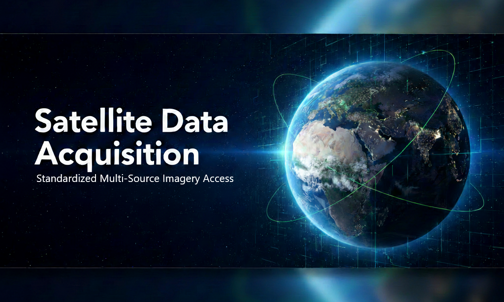

# Satellite Data Acquisition


[](https://github.com/Kongstad/sat-data-acquisition/actions)

<p align="center">
  
</p>

Python package for downloading satellite imagery from multiple sources with a standardized API.

## Table of Contents

- [Features](#features)
- [Quick Start](#quick-start)
  - [Installation](#installation)
  - [Basic Usage](#basic-usage)
  - [Visualization](#visualization)
  - [Save to Disk](#save-to-disk)
- [Available Satellites](#available-satellites)
- [Documentation](#documentation)
- [Common Use Cases](#common-use-cases)
- [Advanced Features](#advanced-features)
- [Development](#development)
- [Requirements](#requirements)
- [Contributing](#contributing)
- [License](#license)
- [Acknowledgments](#acknowledgments)
- [Support](#support)

## Features

- **Multiple satellites**: Sentinel-2, Sentinel-1, Landsat 8/9, HLS (Harmonized Landsat Sentinel), Copernicus DEM
- **Flexible data providers**: Element84, Microsoft Planetary Computer
- **Smart search**: By coordinates or area identifier from GeoJSON
- **Multi-temporal support**: Download imagery across time ranges
- **Cloud filtering**: Configurable cloud coverage thresholds
- **Storage options**: Save to local disk or AWS S3
- **Type-safe API**: Pydantic models for all parameters
- **Reliable and Observable**: Automatic retries, comprehensive logging

## Quick Start

### Installation

**From PyPI (recommended):**
```bash
pip install sat-data-acquisition
```

**For development:**
```bash
# With UV (10-100x faster)
curl -LsSf https://astral.sh/uv/install.sh | sh
uv venv && source .venv/bin/activate
uv pip install -e .
```

### Basic Usage

```python
from sat_data_acquisition import SatDataClient, ProcessingParams

# Define area (Copenhagen example)
geometry = {
    "type": "Polygon",
    "coordinates": [[
        [12.5464, 55.6761], [12.5864, 55.6761],
        [12.5864, 55.7061], [12.5464, 55.7061],
        [12.5464, 55.6761]
    ]]
}

# Configure search
processing_params = ProcessingParams(
    satellite='S2MPC',
    bands=['red', 'green', 'blue', 'nir'],
    start_date='2024-06-01',
    end_date='2024-08-31',
    cloud_coverage=20,
)

# Download
client = SatDataClient()
dataset = client.search_and_create_image(
    geometry=geometry,
    processing_params=processing_params,
)

print(f"Downloaded {len(dataset.time)} images")
```

### Visualization

```python
import matplotlib.org/matplotlib.pyplot as plt
import numpy as np

# Get first image
image = dataset.isel(time=0)
rgb = np.dstack([image['red'], image['green'], image['blue']])

# Display
plt.imshow(rgb / 3000)
plt.title(f"Sentinel-2 - {str(image.time.values)[:10]}")
plt.show()
```

### Save to Disk

```python
from sat_data_acquisition import SaveParams
from sat_data_acquisition.processing import save_data

save_params = SaveParams(
    output_path='./data/images',
    save_to_local=True,
    save_as_geotiff=True,
)

for time_val in dataset.time.values:
    save_data(
        image=dataset.sel(time=time_val),
        identifier='copenhagen',
        datetime=str(time_val),
        satellite='S2MPC',
        provider='MPC',
        save_params=save_params,
    )
```

## Available Satellites

| Satellite | Bands | Resolution | Revisit | Provider |
|-----------|-------|------------|---------|----------|
| Sentinel-2 | RGB, NIR, SWIR, SCL | 10-60m | 5 days | MPC, E84 |
| Sentinel-1 | VV, VH (SAR) | 10m | 12 days | MPC |
| Landsat 8/9 | RGB, NIR, SWIR, Thermal | 30m | 16 days | MPC |
| HLS Sentinel | B01-B12 (harmonized) | 30m | 5 days | MPC |
| HLS Landsat | B01-B12 (harmonized) | 30m | 16 days | MPC |
| Copernicus DEM | Elevation | 30m | Static | MPC |

**Note**: See [docs/SATELLITE_SOURCES.md](docs/SATELLITE_SOURCES.md) for detailed band information.

## Documentation

**Comprehensive guides in [docs/](docs/)**

- **[SATELLITE_SOURCES.md](docs/SATELLITE_SOURCES.md)** - All satellites, bands, wavelengths, resolutions, and use cases
- **[PROCESSING_PARAMETERS.md](docs/PROCESSING_PARAMETERS.md)** - Complete search and processing configuration
- **[SAVE_PARAMETERS.md](docs/SAVE_PARAMETERS.md)** - Local and S3 storage configuration
- **[ARCHITECTURE.md](docs/ARCHITECTURE.md)** - High-level system design and data flow
- **[DEVELOPMENT.md](docs/DEVELOPMENT.md)** - Setup, testing, and contribution workflow

**Working examples in [examples/](examples/)**

Each directory in `examples/` includes single image and multi-image notebooks with visualization.


## Common Use Cases

For detailed code snippets, see the following links:
- [Temporal Analysis](docs/PROCESSING_PARAMETERS.md#temporal-analysis)
- [Cloud Masking with SCL](docs/PROCESSING_PARAMETERS.md#cloud-masking)
- [SAR Monitoring](docs/SATELLITE_SOURCES.md#sentinel-1)
- [Multi-Area Batch Processing](examples/cop30dem/multi_area_download.ipynb)

## Advanced Features

- **Overlapping Tile Handling**: Standardized merging of overlapping satellite passes.
- **S3 Storage**: Direct upload to AWS S3 with configurable paths.
- See [docs/SAVE_PARAMETERS.md](docs/SAVE_PARAMETERS.md) for more.

## Development

See [docs/DEVELOPMENT.md](docs/DEVELOPMENT.md) for detailed information on testing and deployment.

## Requirements

- Python 3.12+
- [UV package manager](https://astral.sh/uv/) (recommended)

## Contributing

Contributions are welcome! Please see [CONTRIBUTING.md](CONTRIBUTING.md) for guidelines.

## License

MIT License - see [LICENSE](LICENSE) file for details

## Acknowledgments

- Element84 for Earth Search STAC API
- Microsoft Planetary Computer for open data access
- ESA and NASA/USGS for satellite programs

## Support

- **Documentation**: See [docs/](docs/) directory
- **Issues**: Open an issue on GitHub
