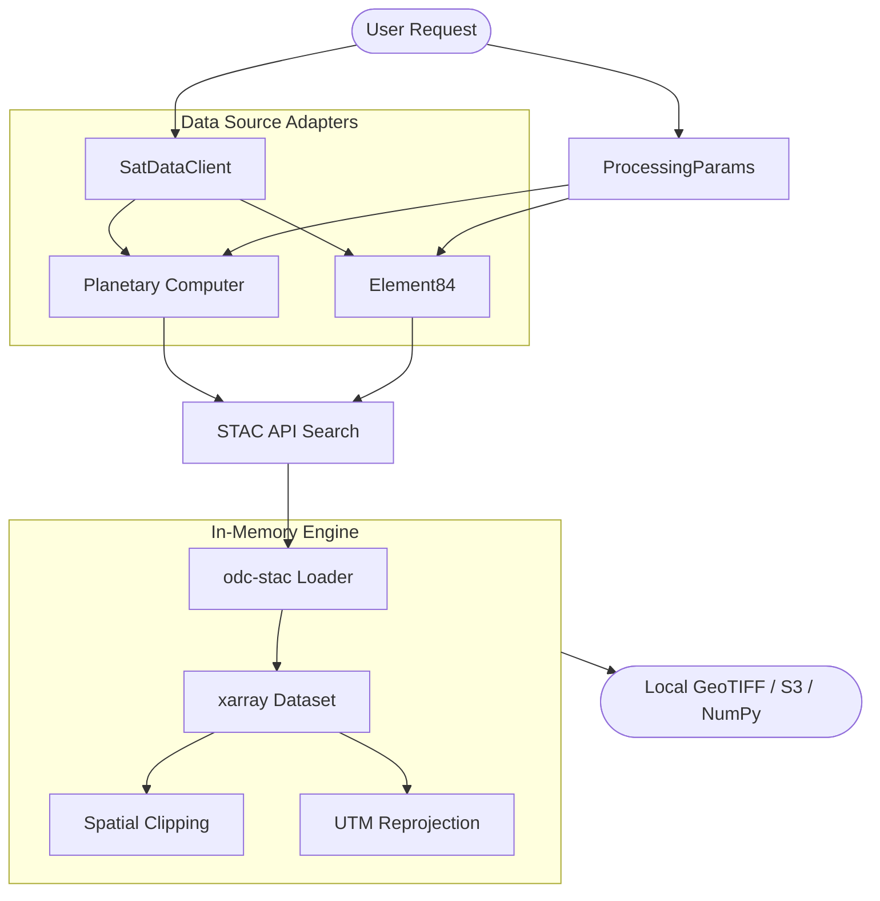

# System Architecture

This document describes the high-level architecture of the `sat-data-acquisition` package.

## Data Flow Diagram

The following diagram illustrates how user requests are transformed into analysis-ready satellite data.

## Core Components

1.  **SatDataClient**: The primary entry point that abstracts provider selection and search logic.
2.  **ProcessingParams**: A validated configuration model ensuring type-safe search and retrieval.
3.  **STAC Providers**: Modular adapters for different STAC catalogs (Microsoft Planetary Computer, Element84).
4.  **odc-stac Engine**: Handles the high-performance loading of Cloud-Optimized GeoTIFFs (COGs).
5.  **xarray Dataset**: The primary in-memory format, providing multi-dimensional, labeled arrays.

## STAC-Native Philosophy

Unlike legacy systems that download entire scenes, this architecture is **STAC-native**. It queries metadata first and leverages lazy-loading to stream only the specific pixels required for the requested geometry, significantly reducing bandwidth and local storage requirements.
